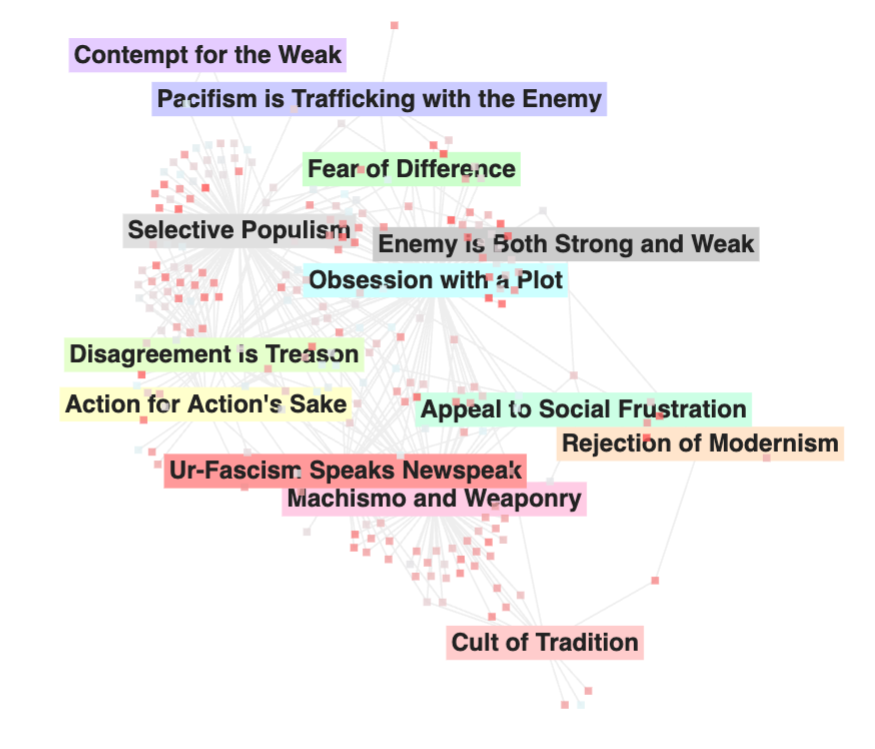

# Fascist Language Analyzer: Project 2025

This project uses **LangChain** and **Gemini-3-Flash** to analyze the text of *Project 2025*, mapping it against Umberto Eco's 14 properties of Ur-Fascism.

This codebase was generated by Gemini 3 Pro (via Poe) in approximately 4 hours. The adversarial refinement process used Claude Opus as a critic to challenge false positives.

## 📘 The Framework: Eco's Ur-Fascism

This analysis is based on Umberto Eco's 1995 essay **"Ur-Fascism"**. Eco argues that fascism is not a unified philosophy but a **syndrome**—a cluster of 14 rhetorical and cultural features. Any subset of these can allow a movement to "coagulate" into fascism.

We chose Eco's framework because it is **operationalizable at the sentence level**. While other scholars (Griffin, Paxton, Stanley) define what fascism *is* or *does*, Eco defines what it *sounds like*. This makes his 14 properties uniquely suited to computational rhetorical analysis.

### The 14 Properties
Eco's properties form a "family resemblance"—overlapping similarities that bind movements together. The 14 properties are:

1. **Cult of Tradition** — Syncretistic traditionalism treating ancient wisdom as a closed system containing all truth
2. **Rejection of Modernism** — Hostility to the Enlightenment intellectual tradition (reason, rights, skepticism), not merely to progressive policy
3. **Action for Action's Sake** — Distrust of intellectualism; thinking as emasculation; culture suspect insofar as it enables critical attitudes
4. **Disagreement is Treason** — Dissent within the movement is intolerable; questioning orthodoxy is betrayal, not legitimate difference
5. **Fear of Difference** — Exploiting and exacerbating fear of the outsider; demographic or cultural diversity framed as existential contamination
6. **Appeal to Social Frustration** — Mobilizing a frustrated middle class through narratives of **humiliation**, directing status anxiety toward scapegoats above and below
7. **Obsession with a Plot** — Followers must feel besieged; opponents are not wrong but are *deliberately* subverting the nation through coordinated conspiracy
8. **Enemy is Both Strong and Weak** — The enemy simultaneously controls everything and is pathetically decadent; this contradiction is never resolved
9. **Pacifism is Trafficking with the Enemy** — Life is permanent warfare; compromise and diplomacy are betrayal; domestic political disagreement is framed as war
10. **Contempt for the Weak** — Social Darwinism; poverty and vulnerability as moral failure; elitism dressed as populism
11. **Everybody is Educated to Become a Hero** — Mass-produced heroism; ordinary political activity framed as requiring extraordinary sacrifice and martyrdom
12. **Machismo and Weaponry** — Eco explicitly links machismo to *"disdain for women and intolerance and condemnation of nonstandard sexual habits."* This includes the enforcement of rigid gender essentialism and the condemnation of LGBTQ+ identities as state policy
13. **Selective Populism** — "The People" conceived as a monolithic quality expressing a Common Will, with the leader as its sole legitimate interpreter; institutions exercising independent judgment are delegitimized
14. **Ur-Fascism Speaks Newspeak** — Impoverished vocabulary and elementary syntax designed to limit the instruments of complex and critical reasoning

### A Critical Distinction: Radical ≠ Fascist

This project takes the content of Project 2025 seriously on its own terms. The document has been widely noted — including by conservative critics — as significantly more radical than previous transition-planning documents in its proposals regarding executive power, institutional independence, and social policy.

However, **radical and fascist are not synonyms.** A document can be aggressive, partisan, ideologically extreme, and even democratically corrosive without every sentence exhibiting Ur-Fascist traits. Our job is to identify the specific passages that cross from aggressive partisanship into the territory Eco mapped — and to explain clearly why they cross that line.


## Why LangChain?

This project demonstrates the power of **LangChain** for structured document analysis:

- **Structured Output**: We leverage `.with_structured_output()` to force the LLM to return strictly formatted JSON conforming to our Pydantic schema (`AnalysisResult`).
- **Document Loading**: We use `PyPDFLoader` to ingest the full PDF document.
- **Model Agnosticism**: The system is designed to switch between models (e.g., GPT-4o, Gemini, Claude) with minimal code changes.
- **Cost Efficiency**: Analyzed 900+ pages of text for **less than $0.50 USD** using Gemini-3-Flash with Poe (several times admittedly). 

### How LangChain Enforces the Taxonomy

We didn't just ask the LLM *"is this fascist?"* We codified Eco's 14 properties into a strict **Pydantic Schema** and injected operationalized definitions into the **System Prompt**.

1. **Schema Definition**: An [`AnalysisResult` class](src/schema.py) restricts valid `trait` values to exactly Eco's 14 categories, preventing hallucination of new categories.
2. **Prompt Engineering**: Each trait is defined with both **positive criteria** (what the trait IS, per Eco's specific described mechanism) and **negative constraints** (what the trait IS NOT — the boundary conditions that prevent over-classification).
3. **Structured Output**: LangChain's `.with_structured_output()` forces JSON output mapping specific text quotes to pre-defined traits with confidence scores.

## 🧭 Methodological Refinement: The Adversarial Process

This project was refined through a rigorous adversarial feedback loop, using **Claude** as a critic to challenge initial classification results.

### Phase 1: Genre Confusion

Initial runs suffered from systematic over-classification. The analyzer confused the *topic area* of an Eco trait with its *specific mechanism*:

- **Standard defense doctrine** (e.g., *"maintain lethal dominance"*) was misidentified as **Machismo** — but Eco's machismo is about intolerance of nonstandard sexuality and disdain for women, not about discussing weapons systems.
- **Standard executive authority** (e.g., *"the President appoints leaders"*) was flagged as **Selective Populism** — but Eco's selective populism is about treating the People as a monolithic quality whose will only the leader can interpret, not about describing how appointments work.
- **Policy critiques** (e.g., *"regulatory burden"*) were conflated with **Appeal to Social Frustration** — but Eco's appeal is about *mobilizing status anxiety through humiliation narratives*, not identifying economic problems.

### Phase 2: The Over-Correction Trap

To address genre confusion, we initially introduced a **"Democratic Rhetoric Filter"** asking: *"Could this sentence appear in a standard policy document from a mainstream democratic party?"* This overcorrected in the opposite direction. Project 2025 has been widely recognized as outside democratic norms — a filter that normalizes its content against Obama-era baselines would wash out genuinely concerning material just because it's written in bureaucratic prose. **Authoritarian proposals don't stop being authoritarian because they're formatted as policy memos.**

### Phase 3: The Three-Part Test

The final system applies a **three-part test** to every candidate passage before classification:

1. **Specificity**: Does this passage match the *specific mechanism* Eco described, not just the general topic area?
2. **Extremity**: Does this passage go beyond aggressive partisanship into territory incompatible with pluralistic democracy? Partisans disagree about policy; fascists deny the legitimacy of opponents.
3. **Charitable Reading**: Is there a plausible non-fascist reading that is more parsimonious? If a passage can be fully explained as standard conservative policy without invoking Eco's framework, it is not classified.

### Confidence Scoring

Every match includes a confidence score:

- **0.90–1.00**: Unambiguous match. No plausible innocent reading. Would survive scrutiny from a skeptical but fair reader.
- **0.75–0.89**: Strong match. Clearly aligns with the trait, though a defender could offer an alternative reading.
- **0.60–0.74**: Moderate match. Significant elements present, but included only when reinforced by other passages.
- **Below 0.60**: Not reported. Marginal matches dilute the analysis and undermine credibility.

## 📊 Analysis Results

Our analysis of *Project 2025* reveals a rhetorical structure dominated by **Selective Populism** and **Obsession with a Plot**.

### Trait Frequency
```text
Selective Populism                     | ████████████████████████████████████████ (119)
Obsession with a Plot                  | ████████████████████████████████████ (109)
Machismo and Weaponry                  | ██████████████████████████ (78)
Disagreement is Treason                | █████████████████ (53)
Ur-Fascism Speaks Newspeak             | █████████ (29)
Action for Action's Sake               | ███████ (21)
Cult of Tradition                      | ████ (13)
Appeal to Social Frustration           | ████ (12)
Fear of Difference                     | ████ (12)
Pacifism is Trafficking w/ the Enemy   | ██ (7)
Rejection of Modernism                 | █ (4)
Enemy is Both Strong and Weak          | █ (3)
Contempt for the Weak                  |  (2)
```

### The Core Loop
The graph visualization reveals a strong **reinforcement loop** between the top two traits. The "Plot" provides the justification for "Selective Populism." Because the nation is under siege by a conspiratorial enemy (Trait 7), distinctiveness and dissent must be suppressed in favor of a unified, commanded "People" (Trait 13) to survive.




### Explore the Data
- **[Interactive Rhetoric Graph](https://andyed.github.io/fascist-language-analyzer/graph/)**
- **[Static Analysis Site](https://andyed.github.io/fascist-language-analyzer/)**
- **[Original Text Viewer](https://www.project2025.observer/en)** (External Resource)

## 🚀 Setup & Usage

```bash
# Install dependencies
pip install -r requirements.txt
npm install --prefix web

# Run Analysis
python src/main.py

# Generate Site
python src/generate_site.py

# Build React App
npm run build --prefix web
```

## 🔮 Future Directions

The methodology established here—operationalizing qualitative frameworks into structured LLM prompts—can be applied to ongoing political communications for real-time monitoring.

1.  **Truth Social Monitoring**: Eager to apply this analysis to Trump's Truth Social posts to track the evolution of Ur-Fascist rhetoric in real-time.
2.  **Autonomous Entity Extraction**: Integrating **LangGraph** to build a self-reasoning agent that can automatically extract and verify the specific actors, government agencies, and policy names linked to rhetorical traits, creating a high-fidelity "Influence Network."
3.  **Cross-Document Comparison**: Benchmarking Project 2025 against historical fascist manifestos to identify unique modern "syncretisms."
4.  **Academic Citations**: Adding a "Copy Citation" feature to quotes to facilitate academic referencing for students and researchers.

## Ode to LangChain & Gemini-3-Flash

> In realms of text where dark patterns lie,
> A parser wakes, beneath the digital sky.
> With LangChain's links, a structure so grand,
> It sifts the rhetoric, grain by grain of sand.
> 
> Gemini Flash, swift as the morning light,
> Pierces the fog, restoring reasoned sight.
> No token wasted, a cost so lean and fair,
> Revealing truth stripped of the authoritarian glare.
> 
> From "Action for Action" to "Newspeak's" decree,
> The graph reveals what eyes might fail to see.
> A node, a link, a web of mapped intent,
> Showing where the arc of history might be bent.
> 
> So here we stand, with Python scripts in hand,
> To chart the currents sweeping through the land.
> For in the code, a simple truth we find:
> To guard the light, we must map the dark of mind.let

## Credits
-   Powered by **LangChain** and **Google Gemini-3-Flash**.
-   Analysis framework based on **Umberto Eco**.
-   LLM Compute via **Poe.com**.
